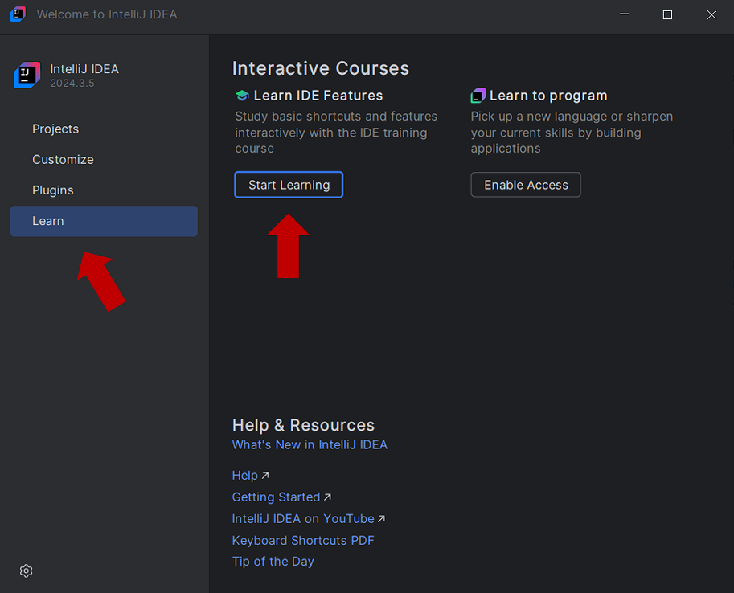

**Визуальные средства разработки программных приложений**

## Лабораторная работа №1

**Тема:** Освоение базовых возможностей *IntelliJ IDEA* через встроенный интерактивный курс.

**Цель работы:** Закрепить навыки работы в интегрированной среде разработки *IntelliJ IDEA*, пройдя встроенную обучающую программу (_IDE Features Trainer_): ознакомиться с интерфейсом и основными инструментами среды, освоить базовые приёмы редактирования, навигации и рефакторинга кода.

#### Ход работы

1. Запустить *IDE IntelliJ IDEA*. В стартовом окне запустить обучающую программу:

  

2. Пройти обучающую программу (42 урока). Для каждого раздела сделать скриншот любого выполненного одного урока.

**Отчёт по лабораторной работе должен содержать:**
1. Цель и задачи работы.
2. Скриншоты выполненных уроков.
3. Вывод.
